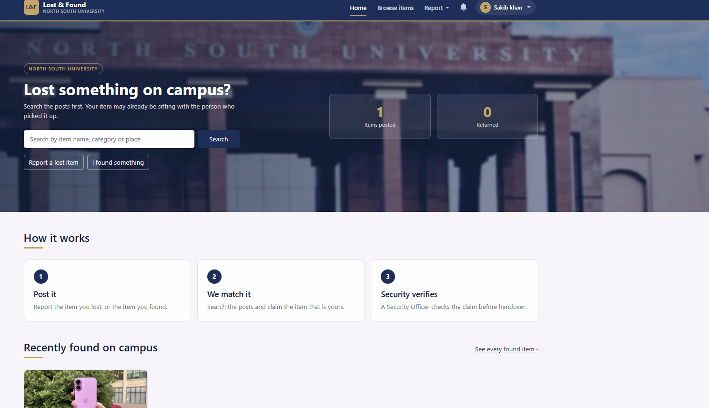

# Lost &amp; Found Management System

A web application for a university campus, where somebody who has lost
something and somebody who has picked it up can find each other, and where a
Security Officer checks every claim before an item is handed over.

Built with **Python / Django** using the **MVT (Model–View–Template)** pattern.

**Course:** Software Engineering (CSE-327) &nbsp;·&nbsp; **University:** North South University

---

## Why this project exists

On a campus, a lost wallet usually travels by word of mouth. Somebody picks it
up, hands it to a friend or leaves it at a desk, and the owner never hears
about it. There is no single place to look, no way to prove an item is yours,
and no record of who handed what to whom.

This system puts all of that in one place:

- **One place to look.** Every lost report and every found report is a post
  that anybody can search by name, category, place or date.
- **Proof before handover.** An item is not simply given to whoever asks for
  it. A claimant has to write down something only the real owner would know,
  and a Security Officer reads that proof beside the item before deciding.
- **Nobody has to keep checking.** The system writes to people when a claim is
  decided, when somebody claims their found item, or when an item like the one
  they lost is handed in.
- **A record that stays.** Every post, claim and decision is kept, so the Admin
  can see what the platform is doing and export the activity as a CSV file.

---

## Screenshot



---

## The ten features

Each feature is a Django app of its own, so two people never have to write in
the same file.

| # | Feature | What it does | App | Built by |
|---|---|---|---|---|
| 1 | **Register an account** | Opens an account with a full name, university or employee ID, email and password. The email is also the username. Passwords are stored hashed. | `register/` | Zihad |
| 2 | **Log in and log out** | Signs a member in and out. A wrong email and a wrong password give the same message, so a stranger cannot learn which emails exist. Five wrong tries shut the account for fifteen minutes. | `login_logout/` | Zihad |
| 3 | **Report a lost item** | Posts something you have lost, with a photo if you have one. The post starts as *Pending*, and you can edit it, take it down, or mark it *Resolved* once you have the item back. | `report_lost_item/` | Ridita |
| 4 | **Report a found item** | Posts something you have picked up. The post starts as *Available* so others can claim it, and closes by itself once a claim is approved. | `report_found_item/` | Jannatul |
| 5 | **Search and filter items** | Searches every post by item name, category or any word in the description, and narrows the list by category, place, type and a date range. All of them work together. | `search_items/` | Jannatul |
| 6 | **Claim an item** | Says a found item is yours and sends the proof of ownership to the security office. One live claim per person per item. | `claim_item/` | Shourov |
| 7 | **Check and approve claims** | The Security Officer's queue. The proof sits beside the item details, and approving one claim closes the item and every other claim on it. Rejecting needs a written reason. | `verify_claims/` | Ridita |
| 8 | **Notifications** | Tells people what happened: a claim was decided, somebody claimed your found item, or an item like the one you lost turned up. Read and unread are marked, and an email copy can be switched on. | `notifications/` | Shourov |
| 9 | **Profile and my history** | Your details, your phone number and photo, and everything you have posted or claimed, filtered by status. Email and ID are locked after registration. | `profile_history/` | Natasha |
| 10 | **Admin management** | Members and their roles, every post, the item categories, the statistics of the whole system, and the activity report as a CSV file. | `admin_panel/` | Natasha |

The full requirements, with the confirmation points a tester has to check for
each feature, are in the [SRS](https://github.com/sanaulislamzihad/Lost-Found-Management-System/wiki/SRS).

---

## The four roles

| Role | What they can do |
|---|---|
| **Student / Staff** | Post lost and found items, search, claim, follow their own history |
| **Security Officer** | Everything above, plus the claim queue at `/verify` |
| **Admin** | Everything above, plus the management pages at `/manage` |

---

## Running it

```bash
git clone https://github.com/sanaulislamzihad/Lost-Found-Management-System.git
cd Lost-Found-Management-System

python -m venv .venv
.venv\Scripts\pip install django pillow      # Linux/macOS: .venv/bin/pip

.venv\Scripts\python manage.py migrate
.venv\Scripts\python manage.py createsuperuser
.venv\Scripts\python manage.py runserver
```

Then open <http://127.0.0.1:8000/>.

> Give the superuser an **email address** as its username (for example
> `admin@northsouth.edu`), because the login box on the site only accepts an
> email. A superuser can reach both `/manage` and `/verify`.

---

## Demo accounts

The database file is not kept in the repository, so a fresh clone starts with
no accounts. This one command makes one account for each role:

```bash
.venv\Scripts\python manage.py createdemousers
```

| Role | Email | Password | Can reach |
|---|---|---|---|
| **Admin** | `admin@northsouth.edu` | `admin123456` | everything, plus `/manage` and Django's `/admin/` |
| **Security Officer** | `officer@northsouth.edu` | `officer123456` | the claim queue at `/verify` |
| **Student** | `student@northsouth.edu` | `student123456` | posting, searching, claiming, own history |

Running the command again resets the three passwords, so it is safe to repeat.

> These are **demo accounts for running the project locally**. They use weak,
> published passwords on purpose, so that anybody marking the project can log
> in. Do not put this system on a real server with these accounts on it.

To change somebody's role afterwards, log in as the Admin and use
**Manage → Users**.

---

## Running the tests

```bash
.venv\Scripts\python manage.py test           # the whole suite
.venv\Scripts\python manage.py test register  # one app
```

The tests are written with **Python unittest** through Django's built-in test
framework, and each feature's tests live in the `tests.py` of that feature's
own app. Django builds a separate test database and throws it away afterwards,
so running them never touches `db.sqlite3`.

---

## How the project is laid out

```
lost_and_found/   settings and the root URL file
core/             the five shared tables: Category, Item, Claim,
                  Notification, Profile
home/             the landing page
<feature apps>/   one app per feature, listed in the table above
templates/        every page
static/           the stylesheet and the images
wiki_repo/        a checkout of the GitHub wiki
```

`core` holds the tables because the ten features read the same data. Everything
else is per feature.

---

## Documentation

All of it lives in the
**[GitHub Wiki](https://github.com/sanaulislamzihad/Lost-Found-Management-System/wiki)**,
with a local checkout in [wiki_repo/](wiki_repo/).

| Page | What it covers |
|---|---|
| **Home** | Landing page and overview |
| **SRS** | Full requirements, all ten features with their confirmation points |
| **Draft UI** | The hand-drawn screens the pages were built from |
| **Architectural Pattern** | Why Django's MVT, and how it maps to this system |
| **Coding Standard** | PEP 8, and how we apply it |
| **Documentation Tool: Sphinx** | How the source-level docs are generated |
| **Meeting Agenda / Minutes 1–3** | What was decided, and who was allocated what |

---

## Git workflow

> This repo has **two** remotes: `origin` for the code and `wiki` for the
> wiki. Check with `git remote -v`.

**Work on a branch, never straight on `main`:**

```bash
git checkout -b feature/my-feature
# ... make your changes ...
git add .
git commit -m "Add my feature"
git push -u origin feature/my-feature
```

Then open a pull request on GitHub (base `main`, compare your branch) and merge
it after review. Afterwards:

```bash
git checkout main
git pull origin main
git branch -d feature/my-feature
```

**Pushing to the wiki** — it is a separate repo whose default branch is
`master`, not `main`:

```bash
cd wiki_repo
git add .
git commit -m "Update the wiki"
git push origin master
```

---

## Team

| Member | Features |
|---|---|
| Md Sanaul Islam Zihad | 1 — Register an account · 2 — Log in and log out |
| Jannatun Ferdousi | 4 — Report a found item · 5 — Search and filter items |
| Shahed Mehbub Shourov | 6 — Claim an item · 8 — Notifications |
| Natasha Anwar | 9 — Profile and my history · 10 — Admin management |
| Ridita Rahman | 3 — Report a lost item · 7 — Check and approve claims |
